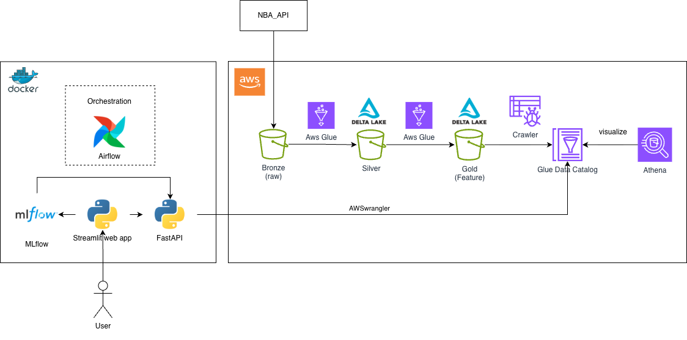
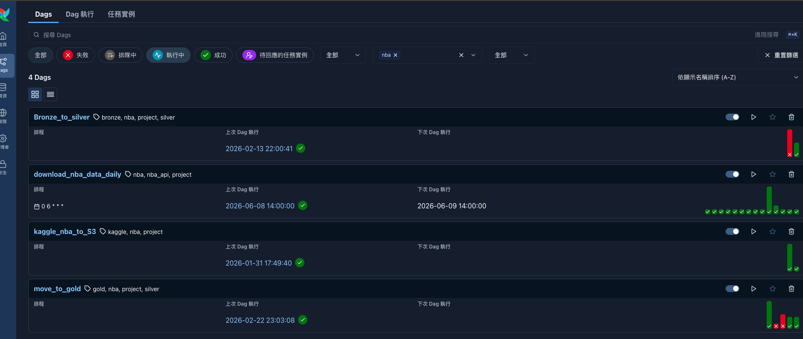
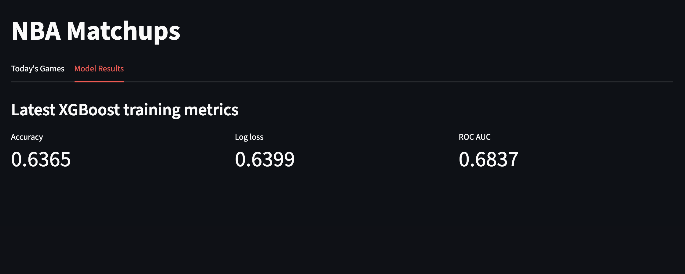
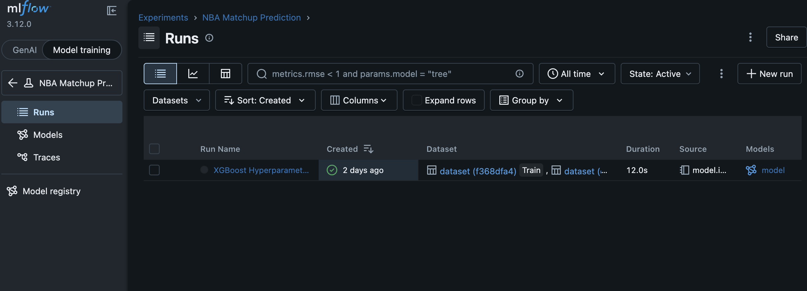

# NBA Game Prediction Platform


An end-to-end, fault-tolerant, and scalable MLOps platform that transforms raw NBA data into high-performance predictive features and XGBoost models.

This end-to-end platform leverages **Delta Lake on AWS S3** to manage data reliability, **Apache Airflow and Glue** for scalable orchestration and data processing, and **FastAPI/Streamlit** for model serving and visualization. The system is built with fault tolerance and MLOps best practices, utilizing **MLflow** for comprehensive experiment tracking and model monitoring.

## 📝 Key Engineering Decisions
**Storage layer**: Implemented a Medallion Architecture (Bronze/Silver/Gold) on AWS S3 using Delta Lake. To support ingesting raw csvs for NBA data and cleaned feature serving data with ACID transcation and schema enforcement.

**Compute & Orchestration**: Built a fault-tolerant orchestration layer using Airflow  for robust workflow management and rich features e.g. backfilling, auto retries. AWS Glue serves as the scalable, serverless engine for data transformation.

**Model Inference & Monitoring**: Model serving via FastAPI for the ease of implementation. And adopted MLflow as the production-standard tool for managing the end-to-end ML lifecycle.

## 🏗️ Architecture




---

## 🛠️ Technologies Used

| Component           | Technology                                    | Purpose                                      |
| ------------------- | --------------------------------------------- | -------------------------------------------- |
| Orchestration       | Apache Airflow                                | Schedule and monitoring pipeline runs        |
| Data Lake Storage   | Amazon S3 , Delta Lake                        | Stored api results csvs, ACID compliant and support time travel|
| Data Processing     | AWS Glue (PySpark)                            | Transform raw data into clean, aggregated tables |
| Visualization       | Streamlit                                     | Build clean User Interface                           |
| API                 | Fast API                                      | Model Serving                                 |
| Model Moitoring     | MLFlow                                        | Monitoring Model Metrics   |
| Container Runtime   | Docker / Docker Compose                       | Ensure consistent builds  |

---
## Model Details
The project use XGBoost for the NBA game predictions.

- XGBoost vs Deep Learning model(nerual network): Provide an interpretable results and is significantly easier to deploy in production-grade environments which allow the project to focus on the operations part of MLOps 
- Single XGBoost vs Ensemble (XGboost + other e.g. Random forest): 
I opted for a single optimized XGBoost model rather than an ensemble, as empirical testing showed that the performance gains from ensemble methods did not justify the added devlopment overhead. 

Model Development Workflow
The development lifecycle was structured into  phases:

1. Feature Engineering & Exploration
Data Exploration: 
Conducted manual inspection of raw game datasets to validate schema integrity and identify key statistical distributions.

    Domain-Driven Feature Engineering: Leveraged basketball domain knowledge to craft high-impact features, including:

    Contextual: IsHome flag and Rest Days calculation.

    Statistical: Rolling averages such as FG_PCT over the last 10 games.

    Performance Metrics: WinRate trends derived from the preceding 10-game window.

2. Data Sets Preparation 
    
    For model development i have used game data from 2010-11 season to 2025-26 seasons (dated at 2026/05/28). 

    Partitioning Strategy: Data was divided into a 70/20/10 ratio (Train/Test/Eval) per season, ensuring the model generalizes well across different basketball eras and roster changes.

    Seasonal Data Splitting: To prevent data leakage and ensure realistic model evaluation as data may vary across seasons, the dataset was split based on seasons rather than randomized points.

3. Model training & Hyperparameter Optimization
    
    The model was implemented using the xgboost package, utilizing a binary:logistic objective function to predict game outcomes.
    ```
    # XGBoost model code snippet
      xgb_model = XGBClassifier(
          objective="binary:logistic",
          eval_metric=['logloss', 'auc'],
          n_estimators=500,
          learning_rate=0.05,
          max_depth=7,
          subsample=0.8,
          random_state=seed,
          tree_method="hist", # Optimized for speed on large datasets
      )
    ```

    Automated Tuning: I utilized Optuna to execute systematic testing across a defined hyperparameter space. The optimization process focused on **maximizing ROC AUC** and **minimizing Log Loss** to ensure the model remains both discriminative and well-calibrated.

    MLOps Integration: Upon identifying the best-performing hyperparameters, the model configuration and resulting metrics were logged directly into MLflow. By logging the exact parameters and metrics in MLflow, There are a clear audit trail for reproducibility


## 🏗 Data Platform details

The data pipeline utilizes a Medallion Architecture to ensure data reliability and consistency, moving data through Bronze, Silver, and Gold layers with fault-tolerant orchestration.

1. Pipeline Orchestration & Bronze Layer

Ingestion: Airflow triggers a daily Python script to fetch the day's NBA game results.

Fault Tolerance: The pipeline is designed for robustness; Airflow executes an automated cleanup of existing daily data before new downloads, ensuring no duplicates or stale artifacts exist. 

2. Silver Layer: Data Cleansing & Delta Lake

Transformation: Airflow triggers an AWS Glue job, which leverages Apache Spark to process raw CSVs.

Data Quality: During transformation, the job performs schema enforcement and cleans null values.

Idempotency & Partitioning: Data is upserted into Delta Lake to maintain idempotency. Tables are partitioned by season, significantly optimizing query performance for features that rely on filtered historical data.

3. Gold Layer: Feature Store & Data processing
The Gold layer serves as the refined feature store, powering both real-time inference and historical data for model training:

feature_inference: Stores calculated features aggregated at the individual team level.

feature_team_opponent_winpct: Stores high-level calculated feature data regarding performance between team pairs.

game_history: A comprehensive master table used for continuous training and model versioning.

##  Web App details

The application is fully containerized to ensure consistent behavior across local development and production environments.

Serving Layer (FastAPI): A lightweight, asynchronous FastAPI service serves as the model inference engine. It encapsulates the pre-processing logic, retrieves the required features from the Gold layer, and returns model predictions with low latency.

User Interface (Streamlit): The Streamlit application acts as the interactive frontend. It is decoupled from the model serving logic, communicating with the FastAPI backend to fetch predictions and display them to the user.

## ⚙️ Fault Tolerance & Reliability

- **Airflow retries** – failed tasks automatically retry up to 3 times (configurable in DAG).
- **Data validation** – Glue jobs perform row count and schema checks before writing.
- **Idempotent writes** – each run overwrites only the relevant partitions, avoiding duplicates. 
- **S3 versioning** – enabled on Bronze bucket to recover raw data if needed.

## Result
Airflow webapi server


Streamlit web app




MLflow portal

